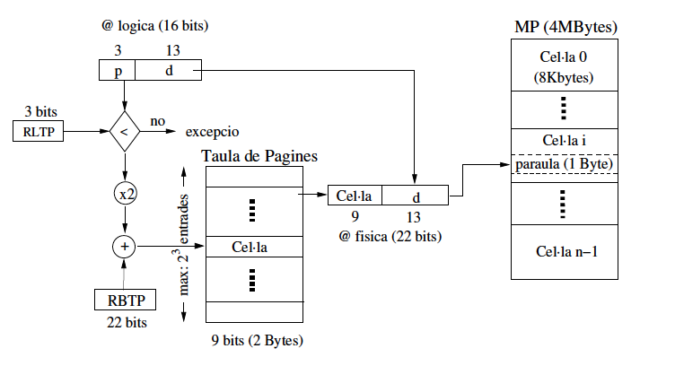
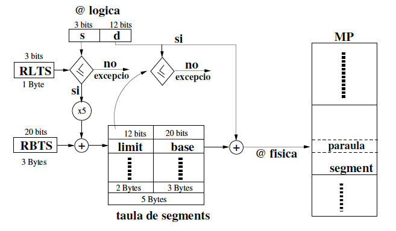
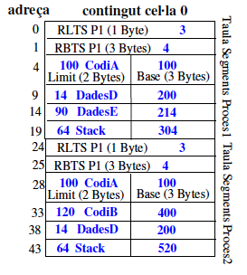
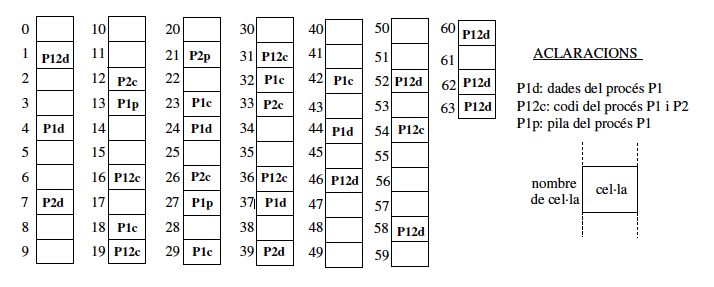
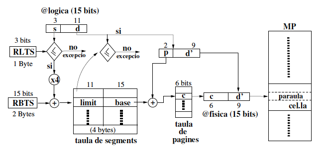
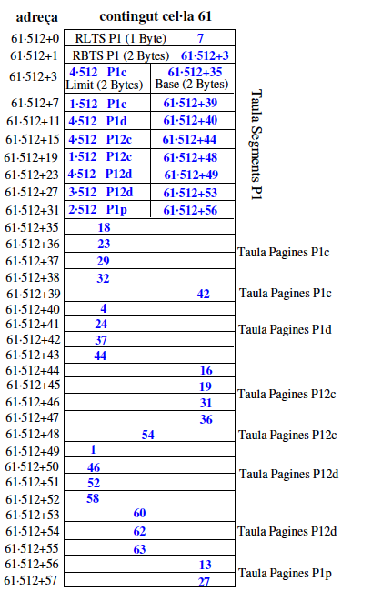
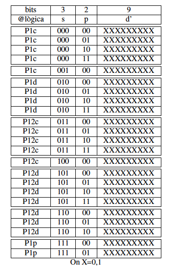

# Gestió de Memòria

## Sistemes de Gestió de Memòria

Assuemix un sistema operatiu amb un únic espai d'adreçament lògic, amb algunes adreçes reservades pel nucli (kernel), i d'altres per l'espai d'usuari. El nucli d'aquest sistema operatiu de 64 bits admet un màxim de \\( 4194304\\) processos a la taula de processos, i al nucli se li assigna la meitat de l'espai d'adreces lògiques. Si l'espai d'adreces de memòria es divideix equitativament entre tots els processos, quant espai d'adreces lògiques es reservaria com a mínim per a cada procés amb el nombre màxim de processos en execució?

Veure Solució

El nombre màxim de processos és \\( 4194304\\). Un sistema de 64 bits té \\( 2^{64}\\) adreçes virtuals.  Però el nucli té la meitat de l'espai d'adreces lògiques. Per tant, el nombre d'adreçes virtuals que té el nucli és \\( \dfrac{2^{64}}{2} = 2^{63}\\).

Per tant, el mínim espai d'adreçament que pot tenir un procés quan tots els processos estan en execució és \\( \dfrac{2^{63}}{2^{22}} = 2^{41} \\) adreçes virtuals, aproximadament 2TB.

## Sistemes de Gestió de Memòria Contigua

Considereu un sistema de particions múltiples on les particions a memoria principal són de mida fixa i en l'ordre següent:

| Partició | Mida (MBytes) |
| -------- | ------------- |
| 1        | 10            |
| 2        | 4             |
| 3        | 20            |
| 4        | 18            |
| 5        | 7             |
| 6        | 9             |
| 7        | 12            |
| 8        | 15            |

a. Si la política d'assignació és First Fit, quina partició s'assignarà per processos successius de 12MBytes, 10MBytes i 9MBytes?

b. Si la política d'assignació és Best-Available-Fit, quina partició s'assignarà per processos successius de 12MBytes, 10MBytes i 9MBytes?

c. Si la política d'assignació és Best-Fit-Only, quina partició s'assignarà per processos successius de 12MBytes, 12MBytes i 9MBytes?

Veure Solució

### First Fit

En aquesta política, la primera partició que es troba amb suficient espai per allotjar el procés és la que s'assigna. Per tant, la partició que s'assigna per processos successius de 12MBytes, 10MBytes i 9MBytes és la partició 3 (20MB), 1 (10MB) i 4(18MB) respectivament.

### Best-Available-Fit

En aquest política, la partició que s'assigna és la que té la mida més petita que sigui suficient per allotjar el procés. Per tant, la partició que s'assigna per processos successius de 12MBytes, 10MBytes i 9Bytes és la partició 7 (12MB), 1 (10 MB) i 6 (9MB) respectivament.

### Best-Fit-Only

En aquesta política, seleccionem la partició que té la mida més petita que sigui suficient per allotjar el procés. Però si esta ocupada esperem. Per tant, la partició que s'assigna per processos successius de 12MBytes, 12MBytes i 9MBytes és la partició 7 (12MB), 7 (12MB) i 6 (9MB) respectivament.

## Sistema de Gestió de Memòria No Contigua

### Paginació

Suposem que disposem d’un sistema de gestió de la Memòria Principal (MP) del tipus paginat, amb una mida de pàgina (cel·la) de 8KBytes. La mida d’una paraula és 1Byte i la mida de MP és 4MBytes. La mida màxima d’un procés és 64KBytes. La taula de pàgines h/w s’implementa en MP.

1. Esquema de traducció d’adreces lògiques a físiques, amb totes les mides de les estructures (o registres que hi apareguin). Poseu-hi també el(s) multiplicador(s) que cregueu convenient(s).

2. Donat un procés P1, amb una mida total de 18KBytes, es demana:

   (a) Rang d’adreçament lògic de P1.

   (b) Fragmentació interna i externa total suposant que no hi ha cap més procés carregat en el sistema.

   (c) Quin és el rang d'adreçament físic de P1? Sabent que la Taula de Pàgines del procés P1 és:

| Pàgina | Cel.la |
| ------ | ------ |
| 0      | 50     |
| 1      | 34     |
| 2      | 3      |

Veure Solució

#### Esquema de traducció d’adreces lògiques a físiques

L'adreça lògica és dividida en dues parts: el desplaçament i el número de pàgina.

- **Desplaçament**: La mida de la pàgina és de 8 KBytes -> \\(2^{13}\\) bytes, i per representar qualsevol desplaçament a l'interior d'una pàgina, necessitem 13 bits.

- **Número de Pàgina**: Per a un nombre màxim de processos de 64KBytes = \\(2^{16}\\), el número màxim de pàgines és la raó entre el nombre màxim de processos i el desplaçament \\(\dfrac{2^{16}}{2^{13}}=2^3\\), per tant, requerim 3 bits per representar el número de pàgina.

- **Número de Cel·les de la Memòria**: El nombre de cel·les a la memòria es calcula igualment, considerant la mida de la pàgina. Si la mida de la Memòria Principal és de 4 MBytes, i la mida de la pàgina és de 8 KBytes, el nombre de bits necessaris per representar les cel·les és \\(\dfrac{2^{22}}{2^{13}}=2^9\\), per tant 9 bits.

- **Adreça lògica** (16 bits): *Pagina* (3bits) + *Desplaçament* (13 bits); Per tant 2 Bytes.

- **Adreça física** (22 bits): *Cel·la* (9 bits) + *Desplaçament* (13 bits); Per tant 3 Bytes.

> **Nota**: El multiplicador és 2, ja que una entrada a la taula de pàgines ocupa 3 bits, i una entrada a la Taula de Pàgines ocupa 9 bits (2 Bytes). Per que les operacions siguin coherents, el multiplicador ha de ser 2.

#### Rang d’adreçament lògic de P1

|p (3 bits)|d (13 bits)|
|----------|-----------|
|000       |xxxxxxxxxxxxx|
|001       |xxxxxxxxxxxxx|
|010       |0000000000000 -> 0011111111111|

En aquesta taula la x representa totes les combinacions de 0 i 1.

Com P1 té una mida total de 18KBytes, el nombre de pàgines és \\(\dfrac{18KBytes}{8KBytes}=2.25\\), per tant, necessitem 2 pàgines i 1/4 de pàgina. Per tant, la pagina 0 i 1 estan plenes i la pàgina 2 està a 1/4.
2KBytes = //(2^11 //)Bytes és 0011111111111 en binari.

#### Fragmentació

La Fragrmentació interna del procés P1 és de 6 KBytes, ja que la pàgina 2 està a 1/4. En aquest cas, la fragmentació externa és de 0, ja que la paginació permet que els processos no estiguin contigus a la memòria.

#### Rang d'adreçament físic de P1

| cel·la (9 bits) | desplaçament (13 bits) |
| --------------- | ---------------------- |
| 50              | \\(50 \cdot 2^{13} \rightarrow (51 \cdot 2^{13}) - 1\\)         |
| 34              | \\(34 \cdot 2^{13} \rightarrow (34 \cdot 35^{13}) - 1\\)         |
| 3               | \\(3 \cdot 2^{13} \rightarrow (3 \cdot 3^{13} + 2^{11}) - 1\\)           |

### Segmentació

Disposem d’un sistema de gestió de la memòria segmentat. La Mida de Memòria Principal és de 1MByte. Un procés consta de com a molt 8 segments. La mida màxima d’un segment és 4KBytes. La taula de segments s'implementa en Memòria Principal. Donats els dos processos següents:

| Segment | Mida        | Procés 1 | Procés 2 |
| ------- | ----        | -------- | -------- |
| Codi (A)| 100 bytes   | X        | X        |
| Codi (B)| 120 bytes   |          | X        |
| Dades (D)| 14 bytes   | X        | X        |
| Dades (E)| 90 bytes   | X        |          |

Les X’s en la taula indiquen quins procediments i dades estan assignats a cada procés. Una fila amb dos o més X’s indica que el segment està compartit. A més, cada procés està format per un segment d’stack de 64 Bytes.

Doneu un exemple que mostri quina és la informació i la seva mida (en bytes), que ha de guardar el s.o. per tal de poder fer la traducció d’adreces dels dos processos quan aquests executin dins de la CPU.

Veure Solució

#### Esquema de traducció d’adreces lògiques a físiques

- **Desplaçament**: La mida màxima d'un segment és de 4KBytes -> \\(2^{12}\\) bytes, i per representar qualsevol desplaçament a l'interior d'un segment, necessitem 12 bits.
- **Segment**: Per a un nombre màxim de segments de 8, necessitarem \\(2^3\\), per tant, requerim 3 bits per representar el segment.
- **Adreça lògica**: *Segment* (3 bits) + *Desplaçament* (12 bits); Per tant 2 Bytes.
- **Adreça física**: La mida de la Memòria Principal és de 1MByte, per tant l'adreça física necessita 20 bits.
- **Límit**: El límit és la mida del segment. Per tant, 12 bits.
- **Base**: La base és la adreça on comença el segment. Per tant, una adreça física de 20 bits.

> **Nota**: El multiplicador és 5, ja que una entrada a la taula de segments ocupa 3 bits, i una entrada a la Taula de Segments ocupa (5 Bytes). Per que les operacions siguin coherents, el multiplicador ha de ser 5.

#### Informació necessària per gestionar la memòria de P1 i P2

El contingut de en memòria és el següent, utilitzarem la primera cel·la disponible per guardar la informació, en aquest cas la cel·la 0.

Observeu que el primer que es guarda és el registre límit de la taula de segments P1 (RLTS) aquest registre ha d'indicar el nombre màxim de segments vàlids per P1.

Com P1 té 4 segments (Codi A, Dades D, Dades E i Stack) el contingut de RLTS és 3 (0,1,2,3). A continuació, es guarda el registre base taula de segments (RBTS) que indica on comença la taula de segments de P1.

Com el RLTS ocupa (1Byte) el RBTS es pot guardar a la cel·la 0 però a +1Byte de distància. D'aquesta manera la taula de seguements de P1 començarà a +3Bytes de distancia de RBTS. A continuació, es guarda el límit del segment, seguit de la base del segment. 

- El primer segment és Codi A que ocupa 100 Bytes, per tant el límit és 100 i la base és l'adreça on començara el segment, En el nostre exemple, hem posat la 100.
- El segon segment és de Dades D que ocupa 14 Bytes, per tant el límit és 14 i la base és 200. A continuació, es guarda el límit del segment, seguit de la base del segment.
- El tercer segment és Dades E que ocupa 90 Bytes, per tant el límit és 90 i la base és 214.  
- El quart segment és Stack que ocupa 64 Bytes, per tant el límit és 64 i la base és 304. Finalment, es guarda el límit del segment, seguit de la base del segment.

Idem per P2. Únicament observeu que hi ha segments de dades compartits entre P1 i P2, per tant, el límit dels segments i les bases dels segments de dades són les mateixes.

> Recordeu que el segments han de ser contigus a la memòria.

### Segmentació paginada

Disposem d’un sistema de gestió de Memòria del tipus segmentació paginada. La mida d’una pàgina és de 512 paraules. La mida d’una paraula és igual a un Byte. Mida pàgina = Mida cel la. Un segment conté com a molt 4 pàgines.

Un procés conté com a molt 8 segments. En la següent figura es pot veure el
contingut de MP:

1. Esquema de traducció d’adreces lògiques a físiques, amb totes les mides de les estructures (o registres que hi apareguin). Poseu-hi també el(s) multiplicador(s) que cregueu convenient(s).

2. Doneu un exemple de la informació (és a dir, d’una possible taula de segments,
de les taules de pàgines i registres), que ha de guardar el sistema operatiu per gestionar la memòria del procés P1. Suposeu per fer-ho que totes les cel·les de P1 i P2 estan plenes. Suposeu també que tota la informació s’ha de posar a partir del començament de la cel la 61 i que aquesta
informació ha d’ocupar el mínim espai possible.

3. Doneu el rang d’adreçament lògic de P1.

4. Quina és l'adreça lògica corresponent a l'adreça física 2050?

Veure Solució

### Esquema de traducció d’adreces lògiques a físiques

### Informació necessària per gestionar la memòria del procés P1

### Rang d’adreçament lògic de P1

### Adreça lògica corresponent a l'adreça física 2050

El nombre 2050 en binari és 00000010000001001010. Per tant, l'adreça lògica és 00000010 00000100 101010.

| s (3 bits) | p (2 bits) | d (9 bits) |
| ---------- | ---------- | ---------- |
| 010        | 00         | 000000010  |

Aquesta adreça correspont al segment 3 (P1d), a la primera pàgina i a la 3ª paraula d'aquesta cel·la.

